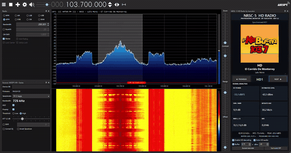
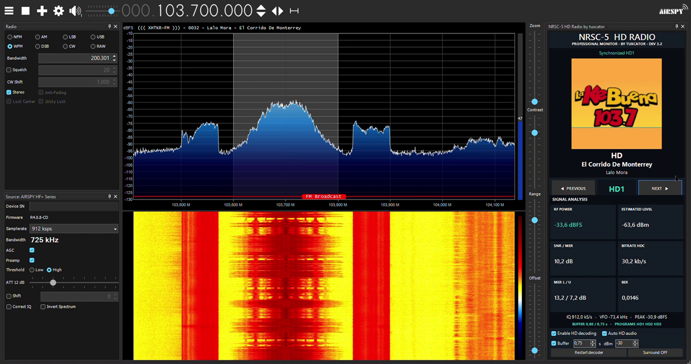
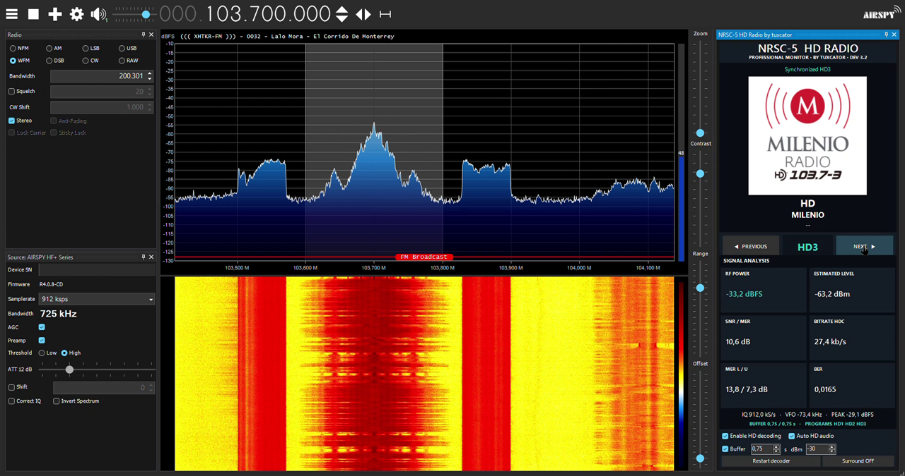

# SDRSharp NRSC-5 HD Radio Plugin

Plugin experimental e independiente para decodificar emisiones FM HD Radio/NRSC-5 dentro de SDR# sin
abrir el Airspy HF+ o RTL-SDR una segunda vez. Toma el flujo IQ que SDR# ya está recibiendo, de modo
que el receptor sigue bajo control de SDR# mientras el plugin decodifica las bandas laterales
digitales en paralelo al audio analógico.

*[English version](README.md)*

<p align="center">
  <a href="https://paypal.me/EmmanuelM183">
    
  </a>
</p>

## En funcionamiento



Recorrido por los tres subcanales de una emisora en 103.7 MHz: el Artwork, los metadatos y todo el
análisis de señal siguen al subcanal seleccionado, y el audio no vuelve al analógico entre uno y
otro. [Ver la captura completa de 50 segundos con audio](docs/media/demo-hd1-hd2-hd3.mp4).

### Capturas de pantalla

La misma emisora en cada uno de sus tres subcanales. Pulse cualquier imagen para verla completa.

| HD1 · La Ke Buena | HD2 · LA AW | HD3 · Milenio Radio |
|---|---|---|
| [](docs/media/screenshot-hd1.png) | [](docs/media/screenshot-hd2.png) | [](docs/media/screenshot-hd3.png) |

Capturado con un Airspy HF+ Discovery a 912 ksps. El campo `Device SN` está enmascarado a propósito.

## Documentación

- [Guía de instalación completa](docs/INSTALACION.md)
- [Full installation guide in English](docs/INSTALLATION.md)
- [Historial de cambios](CHANGELOG.es.md)
- Los paquetes listos para instalar se publican en [Releases](https://github.com/tuxcator/SDRSharp-NRSC5-Plugin/releases).

## Qué hace

- Captura IQ crudo mediante la API oficial de plugins de SDR#.
- Centra digitalmente el VFO seleccionado y remuestrea a 744187.5 muestras complejas por segundo.
- Alimenta `libnrsc5` mediante `nrsc5_open_pipe` y `nrsc5_pipe_samples_cf32`.
- Muestra sincronización, MER, BER, nombre de estación, título, artista y álbum.
- Recibe y muestra el Artwork de la canción y el logotipo de la emisora mediante eventos ID3/XHDR y
  archivos LOT, con resolución por prioridad cuando la emisora no envía XHDR.
- Reemplaza el audio analógico con PCM HD cuando existe sincronía y vuelve al analógico cuando se
  pierde.
- Buffer de audio HD opcional y ajustable por segundos, con indicador de llenado.
- Monitor profesional con potencia dBFS, dBm estimado y calibrable, SNR/MER, MER lateral, BER y
  bitrate HDC real del subcanal seleccionado.
- Subcanales HD1 a HD8, con selector Previous/Next que recorre únicamente los que la emisora
  transmite, descubiertos por la tabla SIG.
- Efecto envolvente opcional que ensancha la imagen estéreo del audio HD.
- Diseño responsivo sin scroll interno: el Artwork cuadrado y las métricas se ajustan al tamaño del
  panel.

## Requisitos

- Windows 10 u 11 de 64 bits.
- SDR# x64 compatible con plugins .NET 9 (`SDRSharp.dotnet9.exe`). El paquete es exclusivamente x64.
- Airspy HF+ Discovery a `768 ksps` (o `912 ksps`), o RTL-SDR a `1.024 MS/s` o más. El decodificador
  necesita al menos **744.1875 kS/s** de IQ.
- Una emisora FM que realmente transmita NRSC-5.

## Instalar

Cierre SDR# y ejecute:

```bat
Instalar.cmd "C:\Ruta\A\SDRSharp"
```

También puede arrastrar la carpeta de SDR# sobre `Instalar.cmd`. El instalador copia:

- `SDRSharp.NRSC5.dll` en `Plugins\SDRSharp-NRSC5-Plugin`.
- Las seis DLL nativas en `NRSC5Runtime`, junto a los ejecutables de SDR# y fuera de `Plugins`,
  porque SDR# examina esa carpeta recursivamente e intentaría cargarlas como ensamblados
  administrados.
- La entrada de `Plugin.xml` cuando SDR# utiliza ese archivo. Las versiones nuevas detectan el
  ensamblado desde su directorio de plugins.

La [guía de instalación](docs/INSTALACION.md) cubre el proceso completo, incluido Smart App Control
de Windows 11 y una tabla de solución de problemas.

## Uso recomendado

1. Seleccione la fuente Airspy HF+ o RTL-SDR en SDR#.
2. Use modo `WFM` y sintonice el centro exacto de la emisora, por ejemplo 103.7 MHz.
3. Configure ancho RF suficiente para toda la señal híbrida, aproximadamente 400 kHz.
4. Airspy HF+: `768 ksps`. RTL-SDR: `1.024` o `1.2 MS/s`.
5. En el Airspy HF+, active **AGC** y **Preamp** y deje **ATT** en 0 dB. Con la ganancia baja la FM
   analógica se escucha bien e incluso decodifica RDS, mientras las bandas laterales digitales
   quedan enterradas en el ruido: es la causa más frecuente de que el HD nunca enganche.
6. Abra **Digital Radio > NRSC-5 HD Radio by tuxcator**.
7. Active **Enable HD decoding** y mantenga **Auto HD audio** para que el plugin alterne solo entre
   analógico y HD.

## Uso del panel

**Subcanales.** Cada cambio de emisora entra en HD1: la lista de subcanales pertenece a la emisora,
así que conservar un HD2 o HD3 al pasar a una emisora que solo transmite HD1 dejaría al decodificador
esperando un audio que nunca llega. Un ajuste fino de la misma emisora, por debajo de 50 kHz, respeta
el subcanal en el que esté. Fuera de eso el selector solo se mueve cuando pulsa **PREVIOUS** o
**NEXT**.

**El cambio de subcanal** no deja pasar la emisión analógica: el nivel baja con una rampa de 20 ms,
el silencio cubre el rellenado del búfer y el nuevo subcanal entra con otra rampa.

**Buffer.** Prebúfer ajustable entre 0.1 y 10 segundos. Más segundos absorben mejor los
desvanecimientos breves; menos reducen la latencia frente al audio analógico. También determina con
cuánta paciencia el plugin vuelve al analógico y cuánto dura el silencio al cambiar de subcanal.

**Surround.** Ensancha la imagen estéreo del audio HD: separa medio y lateral, refuerza el lateral y
le suma una copia retrasada 14 ms, y mantiene los graves por debajo de 250 Hz al centro para que la
mezcla no se vacíe ni se cancele en un altavoz mono. Solo toca el audio del códec, nunca la ruta
analógica de SDR#, y no altera el nivel del centro, así que se percibe como anchura y no como
volumen.

## Compilar

```bat
Compilar.cmd
```

El script descarga el SDK oficial de plugins de SDR# y un SDK .NET 9 local, compila, ejecuta las
pruebas y genera el paquete en `dist\SDRSharp-NRSC5-Plugin`. Por defecto busca el runtime Win64 de
nrsc5 en una carpeta hermana:

```text
..\FM-DX-Windows-Portable\runtime\nrsc5
```

También puede indicar otra ubicación:

```powershell
powershell.exe -NoProfile -ExecutionPolicy Bypass -File .\scripts\Build.ps1 -Nrsc5Runtime "C:\Ruta\A\nrsc5"
```

## Smart App Control de Windows 11

El plugin y el runtime nativo se compilan localmente y no tienen firma comercial. Si Smart App
Control está **Activado**, Windows puede bloquear `SDRSharp.NRSC5.dll` y registrar el evento 3077 de
Integridad de código. No existe una excepción por archivo: use una compilación firmada con un
certificado de una autoridad admitida, o decida desde Seguridad de Windows si desactiva esa
protección. Desactivarla reduce la seguridad y Microsoft indica que no puede volver a activarse sin
restablecer o reinstalar Windows.

## Limitaciones conocidas

- El runtime nativo incluido es Win64. SDR# x86 requeriría compilar nrsc5 y sus dependencias para 32
  bits.
- La recepción depende de que la emisora transmita NRSC-5 y de que ambas bandas laterales digitales
  tengan MER suficiente. Una señal analógica fuerte no lo garantiza.
- El estado del efecto envolvente no se guarda: cada sesión de SDR# arranca con él apagado.
- El plugin no transmite, cifra ni evita controles de acceso. Solo decodifica emisiones recibidas
  legalmente.

## Licencias

El código del plugin se distribuye bajo GPL-3.0-or-later para ser compatible con nrsc5. Los
ensamblados del SDK de SDR# se descargan desde Airspy y no deben publicarse dentro del repositorio.

## Apoyo

Este plugin es software libre y se desarrolla en tiempo libre. Si le resulta útil, una donación es
una forma de agradecerlo: es totalmente opcional y no otorga privilegios, soporte prioritario ni
influencia sobre el desarrollo.

[](https://paypal.me/EmmanuelM183)

<https://paypal.me/EmmanuelM183>
